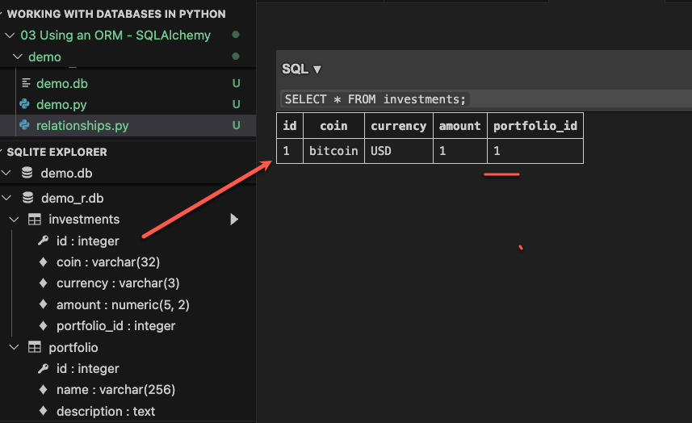
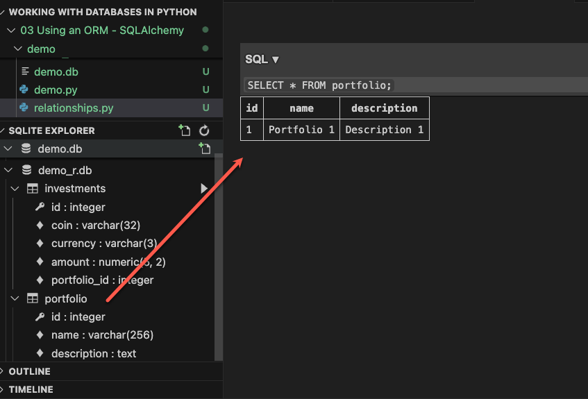
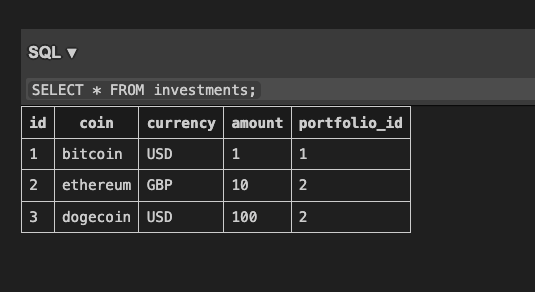
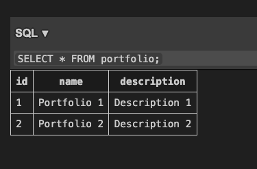

- Define the ```Portfolio``` model class

```python
class Portfolio(Base):
	__tablename__ = "portfolio"
	id: Mapped[int] = mapped_column(primary_key=True)
	name: Mapped[str] = mapped_column(String(256))
	description: Mapped[str] = mapped_column(Text())

	def __repr__(self):
		return f"<Portfolio name: {self.name}, description: {self.description})>"
```

- Add a relationship to this class in the ```Investment``` class

```python
class Investment(Base):
	__tablename__ = "investments"
	
	...

	portfolio_id: Mapped[int] = mapped_column(ForeignKey("portfolio.id"))
	portfolio: Mapped["Portfolio"] = relationship()

class Portfolio(Base):
	__tablename__ = "portfolio"

	...
		
	investments: Mapped[list[Investment]] = relationship()
```

- Set the ```back_populate``` keyword argument to finish the relationship in each relationship

```python
class Investment(Base):
	__tablename__ = "investments"
	
	...

	portfolio_id: Mapped[int] = mapped_column(ForeignKey("portfolio.id"))
	portfolio: Mapped["Portfolio"] = relationship(back_populates="investments")

class Portfolio(Base):
	__tablename__ = "portfolio"

	...
		
	investments: Mapped[list[Investment]] = relationship(back_populates="portfolio")
```

- Add portfolios to the database

```python
bitcoin = Investment(coin="bitcoin", currency="USD", amount=1.00)
ethereum = Investment(coin="ethereum", currency="GBP", amount=10.00)
dogecoin = Investment(coin="dogecoin", currency="USD", amount=100.00)
  
portfolio_1 = Portfolio(name="Portfolio 1", description="Description 1")
portfolio_2 = Portfolio(name="Portfolio 2", description="Description 2")

bitcoin.portfolio = portfolio_1
 
with Session(engine) as session:
	session.add(bitcoin)
	session.commit()
```





- Extend the other objects

```python
portfolio_2.investments.extend([ethereum, dogecoin])

with Session(engine) as session:
	# session.add(bitcoin)
	session.add(portfolio_2)
	session.commit()
```






- We can retrieve the investments from a portfolio

```python
with Session(engine) as session:
	portfolio = session.get(Portfolio, 2)
	for investment in portfolio.investments:
		print(investment)
```

```bash
❯python demo.py

<Investment(coin: ethereum, currency: GBP, amount: 10.00)>
<Investment(coin: dogecoin, currency: USD, amount: 100.00)>
```

```python
def __repr__(self):
	...
	return f"<Portfolio name: {self.name}, description: {self.description}) with {len(self.investments)} investments>"

...

print(portfolio)
```

```bash
❯python demo.py

<Portfolio name: Portfolio 2, description: Description 2) with 2 investments>
```

- We can use the relationship to obtain the portfolio from an investment

```python
investment = session.get(Investment, 1)
print(investment.portfolio)
```

```bash
<Portfolio name: Portfolio 1, description: Description 1) with 1 investments>
```

- Select related objects with the dreaded join, but SQLAlchemy does it simpler, saving time writing the SQL query

```python
stmt = select(Investment).join(Portfolio)
print(stmt)
```

```bash
SELECT investments.id, investments.coin, investments.currency, investments.amount, investments.portfolio_id 
FROM investments JOIN portfolio ON portfolio.id = investments.portfolio_id
```

- Get all portfolios with a bitcoin investment using a subquery
	1. The subquery will select the investments in bitcoin from the investment table
	2. It will match the portfolio ID column for each investment against the portfolio table and return those matches
- The ```c```attibute represent the columns of the subquery
	- As the subquery is not a model class we explicitly need to access the columns this way

```python
portfolio_3 = Portfolio(name="Portfolio 3", description="Description 3")
bitcoin_2 = Investment(coin="bitcoin", currency="USD", amount=2.0)
bitcoin_2.portfolio = portfolio_3

with Session(engine) as session:
	session.add(bitcoin_2)
	session.commit()

	subq = select(Investment).where(Investment.coin == "bitcoin").subquery()
	stmt = select(Portfolio).join(subq, Portfolio.id == subq.c.portfolio_id)
	print(stmt)

	portfolios = session.execute(stmt).scalars().all()
	print(portfolios)
```

```bash
SELECT portfolio.id, portfolio.name, portfolio.description 
FROM portfolio JOIN (SELECT investments.id AS id, investments.coin AS coin, investments.currency AS currency, investments.amount AS amount, investments.portfolio_id AS portfolio_id 
FROM investments 
WHERE investments.coin = :coin_1) AS anon_1 ON portfolio.id = anon_1.portfolio_id

[<Portfolio name: Portfolio 1, description: Description 1) with 1 investments>, <Portfolio name: Portfolio 3, description: Description 3) with 1 investments>]
```
