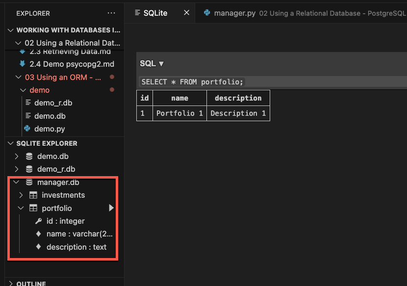
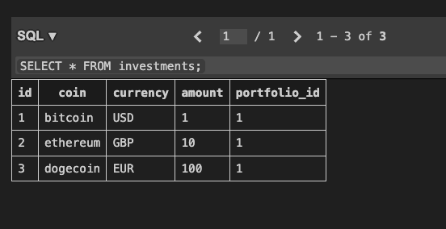

- Create a new portfolio command

```python
@click.command(help="Create a new portfolio")
@click.option("--name", prompt=True)
@click.option("--description", prompt=True)
def add_portfolio(name, description):
	portfolio = Portfolio(name=name, description=description)
	with Session(engine) as session:
		session.add(portfolio)
		session.commit()
	print(f"Added Portfolio '{name}'!")
```

```bash
❯ python manager.py
Usage: manager.py [OPTIONS] COMMAND [ARGS]...

Options:
  --help  Show this message and exit.

Commands:
  add-investment  Add a new investment and add it to a portfolio
  add-portfolio   Create a new portfolio
  clear-database  Drop all tables in the database
  view-portfolio  View the investments in a portfolio

❯ python manager.py add-portfolio
Name: Portfolio 1
Description: Description 1
Added Portfolio 'Portfolio 1'!
```



- Add investment command, we need a list of portfolios
	- Create a query to get all portfolios inside the session.
	- Make the user choose the portfolio
	- Instantiate the investment and link it to the portfolio
	- Persist either the investment or the portfolio

```python
@click.command(help="Add a new investment and add it to a portfolio")
@click.option("--coin", prompt=True)
@click.option("--currency", prompt=True)
@click.option("--amount", prompt=True, type=float)
def add_investment(coin, currency, amount):
	with Session(engine) as session:
		# Get all portfolios
		stmt = select(Portfolio)
		all_portfolios = session.execute(stmt).scalars().all()

		# Print a list of portfolios along with an index for the user to choose from
		for index, portfolio in enumerate(all_portfolios):
			print(f"{index + 1}: {portfolio.name}") 

		# Get that index from the user to choose a portfolio
		portfolio_index = int(input("Select a portfolio: ")) - 1
		portfolio = all_portfolios[portfolio_index]

		# Crete the investment
		investment = Investment(coin=coin, currency=currency, amount=amount)
		portfolio.investments.append(investment)  

		# Persist the investment
		session.add(portfolio)
		session.commit()

		print(f"Adeed new {coin} investment to portfolio '{portfolio.name}'")
```

```bash
❯ python manager.py add-investment
Coin: bitcoin
Currency: USD
Amount: 1.0
1: Portfolio 1
Select a portfolio: 1
Adeed new bitcoin investment to portfolio 'Portfolio 1'
❯ python manager.py add-investment
Coin: ethereum
Currency: GBP
Amount: 10.0
1: Portfolio 1
Select a portfolio: 1
Adeed new ethereum investment to portfolio 'Portfolio 1'
❯ python manager.py add-investment
Coin: dogecoin
Currency: EUR
Amount: 100.0
1: Portfolio 1
Select a portfolio: 1
Adeed new dogecoin investment to portfolio 'Portfolio 1'
```


- View portfolio command
	- Get a list of portfolios
	- Display to the user to choose
	- Get that portfolio and its investments
	- Get coins and currencies deduplicating them
	- Get the dict with prices for coins and currencies
	- Calculate prices and print

```python
@click.command(help="View the investments in a portfolio")
def view_portfolio():
	# Get a list of all portfolios
	with Session(engine) as session:
		stmt = select(Portfolio)
		all_portfolios = session.execute(stmt).scalars().all()
  
		# Display to choose a portfolio
		for index, portfolio in enumerate(all_portfolios):
			print(f"{index + 1}: {portfolio.name}")

		# Get the portfolio and its investments
		portfolio_index = int(input("Select a portfolio: ")) - 1
		portfolio = all_portfolios[portfolio_index]
		investments = portfolio.investments

		# Get coins and currencies from investments
		coins = set([investment.coin for investment in investments])
		currencies = set(investment.currency for investment in investments)

		# Get prices for the coins
		coin_prices = get_coin_prices(coins, currencies)
		print(f"Investments in {portfolio.name}")

		for index, invesment in enumerate(investments):
			coin_price = coin_prices[invesment.coin][invesment.currency.lower()]
			total_price = float(invesment.amount) * coin_price
			print(f"{index + 1}: {invesment.coin} {total_price:.2f} {invesment.currency}")
```

```bash
❯ python manager.py view-portfolio
1: Portfolio 1
Select a portfolio: 1
Investments in Portfolio 1
1: bitcoin 103316.00 USD
2: ethereum 17898.30 GBP
3: dogecoin 13.83 EUR
```
