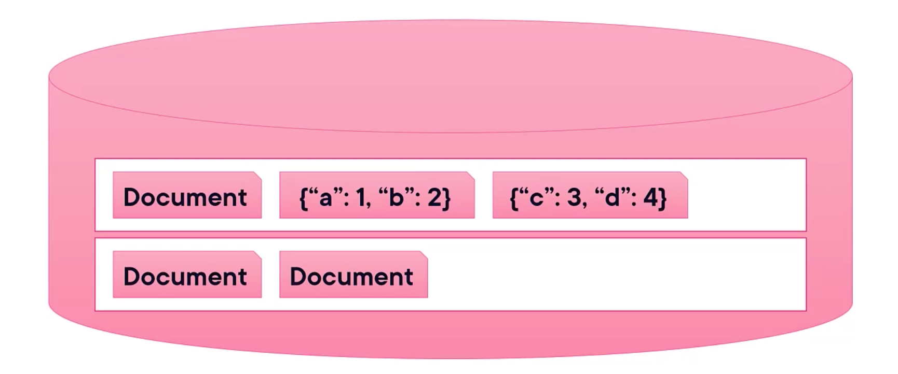

# SQL vs. NoSQL?

- NoSQL databases does not replace SQL databases
- NoSQL compliments SQL databases
- Some NoSQL databases include AQL like Query languages

# What is non-rlational?

- Relational databases use tabular data structures related by common keys
- The ony commonality between NoSQL databases is that they don't follow this patter
- There are many types of NoSQL databases:
	- Document oriented (MongoDB)
	- Column oriented (Cassandra)
	- Key-Value (Redis)
	- Graph (Neo4j)

# Crash course in MongoDB

- A database is a group of collections
- A collection is a group of documents
- A document stores data (conceptually) in JSON
	- Actually, it's stored in BSON, a binary representation of JSON
- The documents are schema-less and the structure is not enforced

