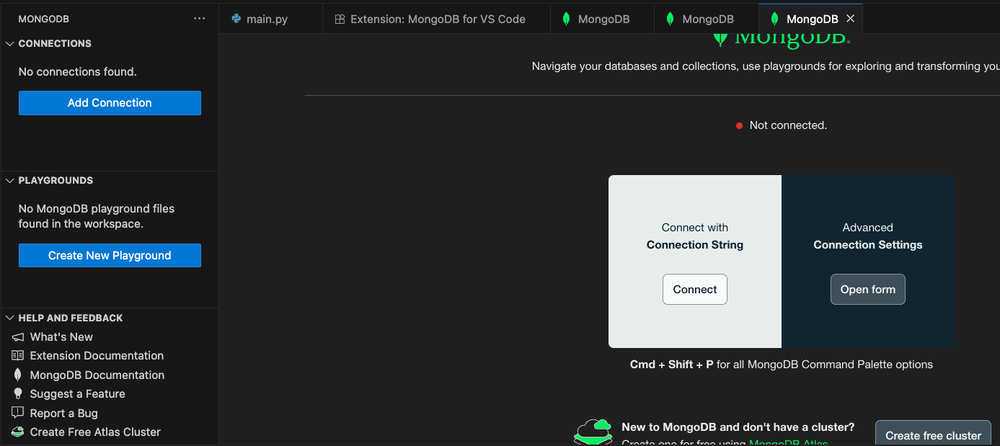
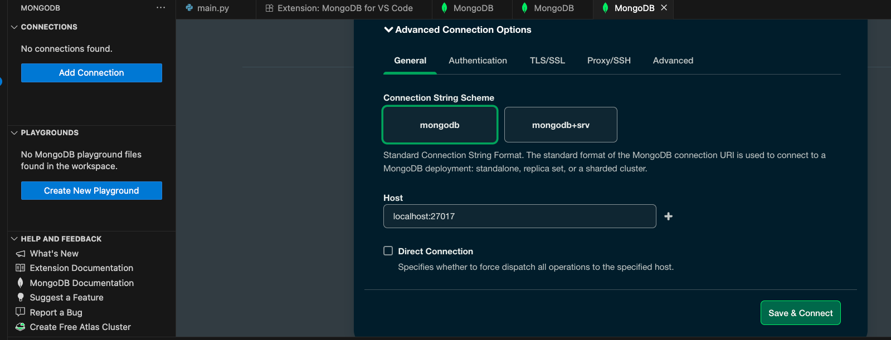
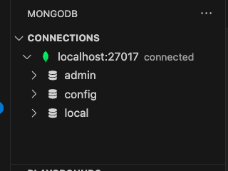
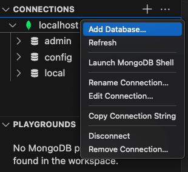
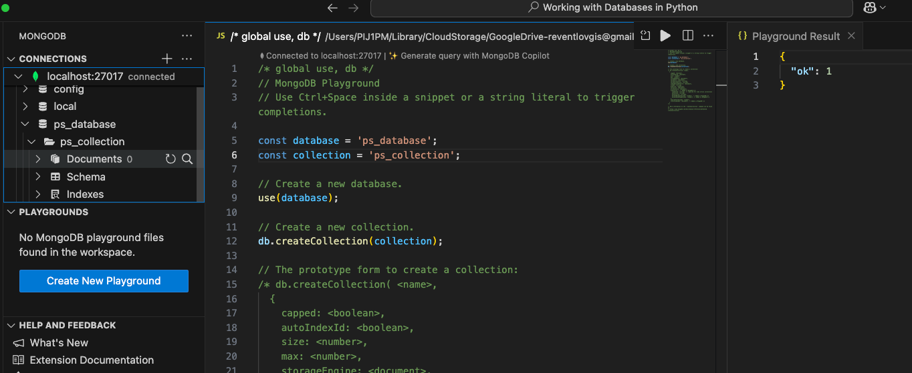
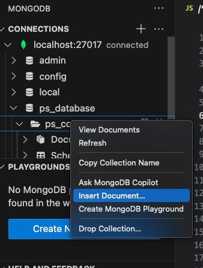
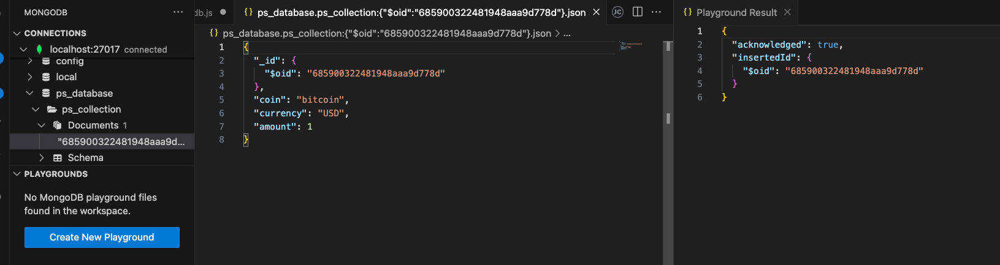

```cardlink
url: https://code.visualstudio.com/docs/azure/mongodb
title: "Working with MongoDB"
description: "Working with MongoDB in Visual Studio Code"
host: code.visualstudio.com
image: https://code.visualstudio.com/opengraphimg/opengraph-docs.png
```


- Docker container for a local MongoDB.
	- For dev without password

```bash
docker run -d --name mongo-local -p 27017:27017 mongo:7
```

```bash
docker run -d \
  --name mongo-local \
  -p 27017:27017 \
  -e MONGO_INITDB_ROOT_USERNAME=root \
  -e MONGO_INITDB_ROOT_PASSWORD=secret \
  mongo:7
  ```

- Connect to the database.







- Add a new database
	- Right click and *Add Database...* will open a script that will create a new database and collection (*MongoDB playground*).



```python
const database = 'ps_database';
const collection = 'ps_collection';  
use(database);
db.createCollection(collection);
```

- Refresh the database



- Insert a document by right clicking, *insert Document...*, insert the document in the playground.



```python
use('ps_database');
db.getCollection('ps_collection').insertOne({
	"coin": "bitcoin",
	"currency": "USD",
	"amount": 1.0
});
```

- Refresh and check.
	- MongoDB generated an ID for the new document.

