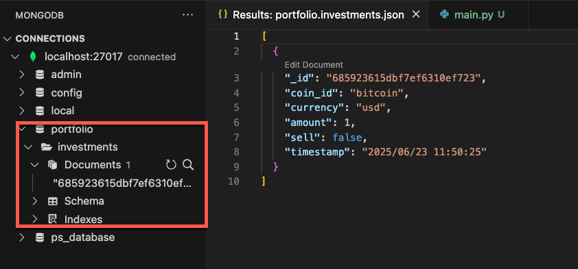

- As ```mongita``` is a subset of ```pymongo``` the migration takes minimal changes from the previous demo.

[[Courses/python-advanced-learning/Working with Databases in Python/05 Using a NoSQL Database- MongoDB and PyMongo/demo/main.py]]

- Connecting with ```pymongo```.
	- For the local setup, no arguments are needed in the client initialization, as ```pymongo``` will connect to the port 27017 locally.


```python
# from mongita import MongitaClientDisk
from pymongo import MongoClient

#client = MongitaClientDisk()
client = MongoClient()
```

- Testing the application

```bash
❯ python main.py add-investment --coin_id=bitcoin --currency=usd --amount=1.0
Added buy of 1.0 bitcoin
```


