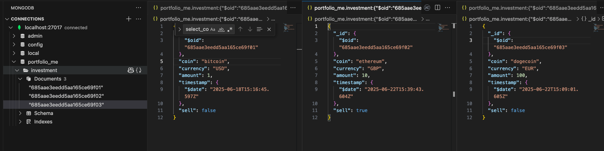
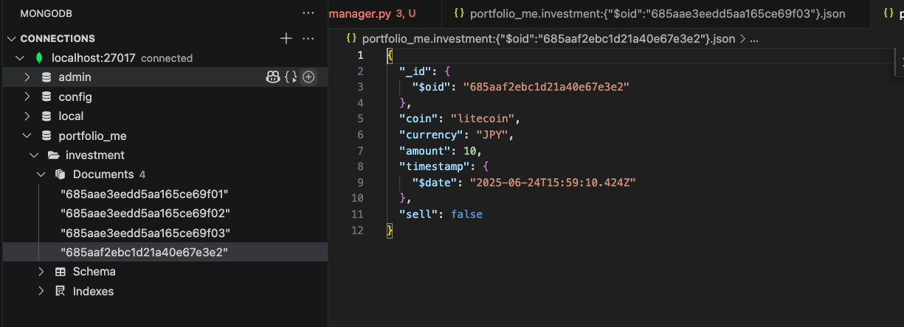

[[Courses/python-advanced-learning/Working with Databases in Python/06 Using a ODM - MongoEngine/demo/manager.py|manager]]

- The ```connect``` import is used to connect to the MongoDB server and the database.

```python
from mongoengine import connect, Document, fields
```

- The ```Investmnetn``` document model subclasses ```Document```, and each attribute of the class will become a field in the document.
	- The ```__repr__``` method does not work with MongoEngine, so we can use ```__str__```.

```python
class Investment(Document):
	coin = fields.StringField(max_length=32)
	currency = fields.StringField(max_length=3)
	amount = fields.FloatField(min_value=0.00001)
	timestamp = fields.DateTimeField(default=datetime.datetime.now)
	sell = fields.BooleanField(default=False)

	def __str__(self):
		return f"<Investment | coin={self.coin}, currency={self.currency}, amount={self.amount}, timestamp={self.timestamp}, sell={self.sell})>"
```

- In the entry point call the ```connect``` function with the database name.

```python
if __name__ == "__main__":
	connect("portfolio_me")
	cli()
```

- Helper function to clear the database with the ```drop_collection``` method called on the document model instance.

```python
@click.command(help="Clear the database")
def clear_data():
	Investment.drop_collection()
	print("Cleared data!")
```

- To seed the database, create several investment documents and save them to the database. 
	- Since I don't need to keep a reference to the document in the ```_seed_data function```, just call ```save``` on the initializer.


```python
def _seed_data():
	data = [
		("bitcoin", "USD", 1.0, False),
		("ethereum", "GBP", 10.0, True),
		("dogecoin", "EUR", 100.0, False),
	]
	for row in data:
		Investment(
			coin=row[0],
			currency=row[1],
			amount=row[2],
			sell=row[3],
			timestamp=datetime.datetime.now()
			- datetime.timedelta(
				days=random.randint(0, 7),
				minutes=random.randint(0, 60),
				seconds=random.randint(0, 60),
			),
		).save()

@click.command( help="Seed the database with sample data, use the --force flag to ignore existing data")
@click.option("--force", is_flag=True, default=False)
def seed_data(force):
	if force:
		_seed_data()
	elif Investment.objects.count() > 0:
		print("Data not empty! Use --force flag to seed database")
	else:
		_seed_data()
```

- To see the investment's  detail, use the ```view_investment``` command. 
	- It starts off by telling the user to select an investment, handled by the ```_select investment function```. 
	- The function gets all the documents in the investments collection. 
	- The ```fields(coin=1)``` method in MongoEngine will select the fields to return like how PyMongo would use a projection document.
		- Each field you want to include should be set to 1 as a keyword argument.
		- If it's easier to tell Mongo which field to exclude, we can set them to 0 and MongoEngine will return the compliment.
	- Like PyMongo, the object ID is always returned.
	- Display the investments
	- Tell the user to select one.
	- Use the ObjectId to get the full document (```first``` method as it should only be one).

```python
def _select_investment():
	investment_coins = Investment.objects.all().fields(coin=1)
	for index, coin in enumerate(investment_coins):
		print(f"{index + 1}: {coin.coin}")
	selected_investment_index = int(input("Select an investment: ")) - 1
	selected_investment_oid = investment_coins[selected_investment_index].id
	return Investment.objects(id=selected_investment_oid).first()
```


- In the ```view_investment``` function use the coin and currency of the investment to get the current price.
- Display the detail of the investment at the command line and include the total value.


```python
@click.command(help="See the details of an investment")
def view_investment():
	selected_investment = _select_investment()
	coin_price = get_coin_prices(
		[selected_investment.coin], selected_investment.currency.lower()
	)[selected_investment.coin]
	print(
		f"You {'bought' if not selected_investment.sell else 'sold'} {selected_investment.amount} {selected_investment.coin} for {coin_price * selected_investment.amount} {selected_investment.currency}"
	)
```

- To add a new investment, use the ```add_investment``` command.
	- Get values for coin, currency, amount, and sell from the command line or prompts.
	- Use them to initialize a new investment document.
	- Save the document to the investment collection. 

```python
@click.command(help="Add a new investment to the portfolio")
@click.option("--coin", prompt=True, help="The name of the coin")
@click.option("--currency", prompt=True, help="The fiat currency to show prices in")
@click.option("--amount", prompt=True, help="The purchase amount")
@click.option("--sell", is_flag=True, default=False, help="If this is a sell (default is False)")
def add_investment(coin, currency, amount, sell):
	investment = Investment(coin=coin, currency=currency, amount=amount, sell=sell)
	investment.save()
	print(f"Added {'buy' if not sell else 'sell'} for {amount} {coin} in {currency}")
```

- Clear the database and seed.
	- MongoEngine does not require you to include the object id in the Document model class,  unlike SQLAlchemy .
	- MongoEngine doesn't add anything to MongoDB, so it lets MongoDB create the object id for each document.
	- The values for sell are lowercase because, this is conceptually JSON and boolean values are lowercase in JSON.

```bash
❯ python manager.py clear-data
All data cleared!
❯ python manager.py seed-data
```



- Add a new investment and display it.

```bash
❯ python manager.py add-investment
Coin: litecoin
Currency: JPY
Amount: 10
Added buy for 10 litecoin in JPY

❯ python manager.py view-investment
1: bitcoin
2: ethereum
3: dogecoin
4: litecoin
Select an investment: 4
You bought 10.0 litecoin for 121998.3 JPY
```


