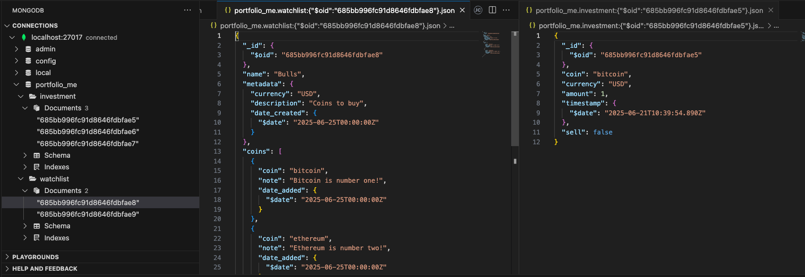

[[watchlists.py]]

- The metadata is stored in an embedded document, thus the watchlist metadata document model class will derive from embedded document.

```python
class WatchlistMetadata(EmbeddedDocument):
	currency = fields.StringField(max_length=3)
	description = fields.StringField()
	date_created = fields.DateField(default=datetime.datetime.now().date)
```

- The coins will be stored in the list, so each Coin document model class will derive from an embedded document as well.

```python
class WatchlistCoin(EmbeddedDocument):
	coin = fields.StringField(max_length=32)
	note = fields.StringField()
	date_added = fields.DateField(default=datetime.datetime.now().date)
```

- The Watchlist document model class will derive from the plain document base.
	- The metadata field will be an ```EmbeddedDocumentField``` expecting a watchlist metadata document.
	- The coins will be an ```EmbeddedDocumentListField``` type and the document it expects are of watchlist coin and that takes care of the documents.

```python
class Watchlist(Document):
	name = fields.StringField(max_length=256)
	metadata = fields.EmbeddedDocumentField(WatchlistMetadata)
	coins = fields.EmbeddedDocumentListField(WatchlistCoin)

	def __str__(self):
		return f"<Watchlist name={self.name}, currency={self.metadata.currency} with {len(self.coins)} coin(s)>"
```

- The ```clear_data``` command to is updated to also drop the watchlist collection.

```python
@click.command(help="Clear the database")
def clear_data():
	Investment.drop_collection()
	Watchlist.drop_collection()
	print("Cleared data!")
```

- Updated the ```seed_data``` command to add two sample watchlists.

```python
def _seed_data():
	data = [
		("bitcoin", "USD", 1.0, False),
		("ethereum", "GBP", 10.0, True),
		("dogecoin", "EUR", 100.0, False)
	]

	watchlist_data = [
		("Bulls", "Coins to buy", "USD", [
		("bitcoin", "Bitcoin is number one!"), ("ethereum", "Ethereum is number two!")])
		("Bears", "Coins to sell", "GBP", [("solana", "Meh ...")])
	]

	for row in data:
		Investment(
			coin=row[0],
			currency=row[1],
			amount=row[2],
			sell=row[3],
			timestamp=datetime.datetime.now() - datetime.timedelta(
				days=random.randint(0, 7), minutes=random.randint(0, 60), seconds=random.randint(0, 60)
			)).save()
  
	for row in watchlist_data:
		Watchlist(
			name=row[0],
			metadata=WatchlistMetadata(description=row[1], currency=row[2]),
			coins=[WatchlistCoin(coin=coin[0], note=coin[1])
				for coin in row[3]]
		).save()
```

- The demo adds three new commands. 

- The first one will add a watchlist. 
	- The command accepts three options from either the command line or prompts for name, description, and currency.
	- The currency and description are used for the ```WatchlistMetadata```.
	- The metadata becomes the value for the metadata keyword argument in the watchlist along with the name option value.
	- And to be explicit, the ```coins``` is set to an empty list.
	- Save the document and tell the user it worked.


```python
@click.command(help="Add a new watchlist to the portfolio")
@click.option("--name", help="The name of the watchlist", prompt=True)
@click.option("--description", help="The description of the watchlist", prompt=True)
@click.option("--currency", help="The currency to display coin prices in", prompt=True)
def add_watchlist(name, description, currency):
	metadata = WatchlistMetadata(currency=currency, description=description)
	watchlist = Watchlist(name=name, metadata=metadata, coins=[])
	watchlist.save() 

	print(f"Added watchlist {name}")
```


- The other two commands will want a watchlist to be selected.

- Helper function that pulls all of the watchlist documents.
	- Uses the fields method to include only the names.
		- Like the projection document with PyMongo, the object ID will still be included.
	- Display the names of the user and have them select one.
	- Grab the object id for the selected watchlist.
	- Use it to retrieve the full document.
		- The first method will return an actual document and not a list.

```python
def _select_watchlist():
	watchlist_names = Watchlist.objects.all().fields(name=1)
	for index, name in enumerate(watchlist_names):
		print(f"{index + 1}: {name.name}")
	selected_watchlist_index = int(input("Select a watchlist: ")) - 1
	selected_watchlist_oid = watchlist_names[selected_watchlist_index].id
	return Watchlist.objects(id=selected_watchlist_oid).first()
```

- The ```view_watchlist``` command.
	- It will use the ```selected_watchlist``` to get a list of the coin names.
	- The ```get_coin_prices``` function from the utils module takes the coins list and the currency from the metadata document in the watchlist to get the prices of the coins.
	-  Print the watchlist info.
	- Iterate through the coins to display the price of each coin.
```python
@click.command(help="View the coins in a watchlist")
def view_watchlist():
	selected_watchlist = _select_watchlist()
	coins = [coin.coin for coin in selected_watchlist.coins]
	coin_prices = get_coin_prices(coins, selected_watchlist.metadata.currency.lower())
	print(f"Watchlist: {selected_watchlist.name} in {selected_watchlist.metadata.currency}")
	print(f"{selected_watchlist.metadata.description}")
	print("Coins: ")
	for index, coin in enumerate(coins):
		print(f"{index + 1}: {coin} | {coin_prices[coin]}")
	print("Prices provided by CoinGecko")
```

- The ```add_coin function```.
	- Gets a coin and note from the command line or prompts.
	- Then it will select a watchlist with the ```_select_watchlist``` helper.
	- The coin note are used to create a new WatchlistCoin document that is appended to the coins list of the selected watchlist. 
		- The ```EmbeddedDocumentListField``` supports the Python List API.
	- Since something new is being added to the watchlist document, we must call the ```save``` method to persist it. 

```python
@click.command(help="Add a coin to a watchlist")
@click.option("--coin", help="The coin to add", prompt=True)
@click.option("--note", help="A note", prompt=True)
def add_coin(coin, note):
	selected_watchlist = _select_watchlist()
	selected_watchlist.coins.append(
		WatchlistCoin(coin=coin, note=note)
	)
	selected_watchlist.save()

	print(f"Added {coin} to {selected_watchlist.name}")
```

- Clear the database and seed.

```bash
❯ python watchlists.py clear-data
Cleared data!
❯ python watchlists.py seed-data
```



- Take a look at one of the watchlists with the view‑watchlist command, select 1 for the Bulls watchlist.

```bash
❯ python watchlists.py view-watchlist
1: Bulls
2: Bears
Select a watchlist: 1
Watchlist: Bulls in USD
Coins to buy
Coins: 
1: bitcoin | 106451
2: ethereum | 2430.85
Prices provided by CoinGecko
```

- Add a watchlist with the ```add‑watchlist``` command, and a coin to the watchlist.

```bash
❯ python watchlists.py add-watchlist
Name: my Watchlist
Description: it's a watchlist
Currency: JPY

❯ python watchlists.py add-coin
Coin: litecoin
Note: Not very heavy
1: Bulls
2: Bears
3: my Watchlist
Select a watchlist: 3
Added litecoin to my Watchlist

❯ python watchlists.py view-watchlist
1: Bulls
2: Bears
3: my Watchlist
Select a watchlist: 3
Watchlist: my Watchlist in JPY
it's a watchlist
Coins: 
1: litecoin | 12364.35
Prices provided by CoinGecko
```
